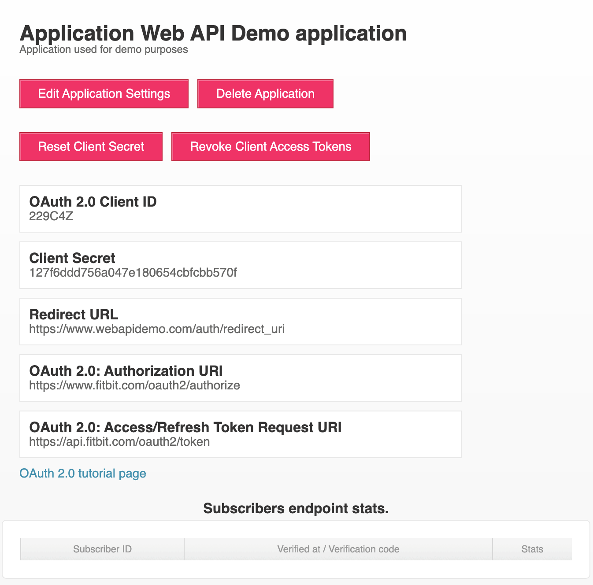

# Fitbit Data Download

This folder contains an example script that allows a user to download their own data. It serves only as a utility for easily downloading the data for research purposes and helps walk through the basic concepts needed to build a fully-fledged app that accesses Fitbit data. [See the SenSE App here](https://github.com/Chukwuemeka-Ike/SenSEApp).

Go straight to [Usage](#usage) if you know what you're doing and want to download data immediately. Otherwise, please read through in order.

# Attribution
1. The main data_download script is based on the work by Michael Galarnyk in this [Medium article](https://towardsdatascience.com/using-the-fitbit-web-api-with-python-f29f119621ea).
2. The contents of the python_fitbit folder are copied from the [python-fitbit project](https://github.com/orcasgit/python-fitbit). Slight modifications have been made to allow one use Python 3.8.10 since the original module is no longer updated.

# Background
## Fitbit Data Access and Authorization Process
All Fitbit data access needs to go through the [Web API](https://dev.fitbit.com/build/reference/web-api/) and use a **Client ID** and **Client Secret**. Fitbit uses "Apps" to streamline this authorization process. The following list is a short form from Fitbit's [Getting Started page](https://dev.fitbit.com/build/reference/web-api/developer-guide/getting-started/). For more details, please refer to that link.

1. Create a Fitbit Developer Account (https://accounts.fitbit.com/signup)
2. Register a Fitbit App (https://dev.fitbit.com/apps)

    a. Fill out the required fields

    b. Pick an appropriate application type (https://dev.fitbit.com/build/reference/web-api/developer-guide/application-design/#Application-Types).

    There are three types - "Server", "Client", and "Personal" based on the use case. For quick development, "Personal" will allow a developer work with their data and test out all flows for their application. However, for clinical research and multiple users, "Client" or "Server" types will be necessary. Both need additional permissions to be able to access the intraday time-series that would be useful for more finegrained applications, e.g., for circadian phase shift predictions in the [SenSE App](https://github.com/Chukwuemeka-Ike/SenSEApp).

    c. Set the access type (read or write). You will most likely only be reading data.

Once registration is complete, the app's Client ID and Client Secret needed to run the script in this folder will be available as below.


### Useful Links
1. [Fitbit Account Signup](https://accounts.fitbit.com/signup)
2. [Fitbit App Registration](https://dev.fitbit.com/apps)
3. [Application Types](https://dev.fitbit.com/build/reference/web-api/developer-guide/application-design/#Application-Types)
4. [Authorization Flow](https://dev.fitbit.com/build/reference/web-api/developer-guide/authorization/)
5. [Intraday Data Details](https://dev.fitbit.com/build/reference/web-api/intraday/)


# Usage
All testing was done with Python 3.8.10, so I can only guarantee the script will function with that version. Please modify the commands below 

1. Clone the forked python-fitbit module in the Fitbit Python/ directory.
```bash
git clone https://github.com/Chukwuemeka-Ike/python-fitbit.git python_fitbit
```
2. Install required modules.
```bash
pip install -r requirements.txt
pip install -r python_fitbit/requirements/base.txt
```
3. Update the Client ID and Secret in data_download.py.
```python
# **************************** MODIFY THIS. ****************************
# Set the Client ID + Secret to enable access to the user's data.
CLIENT_ID = ""
CLIENT_SECRET = ""
```
4. Set the strings for the time series of interest. I've included the values for heart rate and steps. More information can be found on Fitbit's API documentation ([helpful starting point](https://dev.fitbit.com/build/reference/web-api/heartrate-timeseries/get-heartrate-timeseries-by-date-range/)).
5. Set the start and end dates of interest. Note that some Fitbit time series do not allow date ranges. Heart rate and steps do.
6. Run the script
```bash
python data_download.py
```
If successful, the script plots the time series and saves the results to a CSV in the same directory it was run from.

